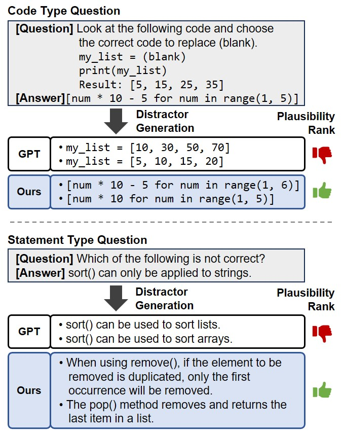

# Generating Plausible Distractors for Multiple-Choice Questions via Student Choice Prediction


<p align="center">
  
</p>


**📄Paper**: [ACL](https://aclanthology.org/2025.acl-long.1154/)       

---

## Table of Contents

- [Folders](#folders)
- [Requirements](#requirements)
- [1. Pairwise Ranker](#1-pairwise-ranker)
  - [1.1. PR SFT](#11-pr-sft)
  - [1.2. PR DPO](#12-pr-dpo)
  - [1.3. PR Inference](#13-pr-inference)
- [2. Distractor Generator](#2-distractor-generator)
  - [2.1. DG SFT](#21-dg-sft)
  - [2.2. DG DPO](#22-dg-dpo)
  - [2.3. DG Inference](#23-dg-inference)
  - [2.4. DG Rank Evaluation](#24-dg-rank-evaluation)
- [Contact](#contact)

---

## Folders

**/dataset**
  - **/public**: 52 questions with no licensing issues
    - `base_mcq_dataset_public.csv`: Base MCQ Dataset
    - `student_choice_dataset_public.json`: Student Choice Dataset
    - `pr_sft_train.csv`, `pr_dpo_train.csv`: Training data for Pairwise Ranker
    - `dg_sft_train.csv`, `dg_dpo_train.csv`: Training data for Distractor Generator
  - **/synthetic**: Newly generated CS questions created using GPT-4o
    - `student_choice_dataset_synthetic.json`: Student Choice Dataset

> [!IMPORTANT]
> In the Student Choice Dataset, the higher the `d_scores`, the more plausible the distractor.

  - **/english**: High school English exam questions
    - These are English questions from the 2025, 2024, and 2023 CSAT (College Scholastic Ability Test). In the experiment, the original Korean questions were translated into English for use. You can check the original questions at [[link]](https://www.suneung.re.kr/boardCnts/list.do?boardID=1500234&m=0403&s=suneung#;).
    - The distractor selection rates for the CSAT English questions were obtained from an online education platform specializing in CSAT preparation. You can check this at [[link]](https://www.megastudy.net/Entinfo/correctRate/main.asp?SubMainType=I&mOne=ipsi&mTwo=588).

**/pairwise_ranker**
  - `pr_sft.py`: SFT code for Pairwise Ranker
  - `pr_dpo.py`: DPO code for Pairwise Ranker
  - `pr_inference.py`: Inference code for Pairwise Ranker

**/distractor_generator**
  - `dg_sft.py`: SFT code for Distractor Generator
  - `dg_dpo.py`: DPO code for Distractor Generator
  - `dg_inference.py`: Inference code for Distractor Generator
  - `dg_evaluation_rank.py`: Evaluation code for Distractor Generator'

---

## Requirements
```bash
pip install -r requirements.txt
```
---

## 1. Pairwise Ranker

### 1.1. PR SFT

First, fine-tune the model to determine which of the two distractors is more challenging to students.
```bash
python pr_sft.py
```

Merge the LoRA adapter into the base model.
```bash
python merge_adapter.py
```

### 1.2. PR DPO
If the model’s reasoning is not yet fully optimized, apply DPO to the training dataset for further improvement.
```bash
python pr_dpo.py
```

### 1.3. PR Inference
The trained model is now ready for inference.
```bash
python pr_inference.py
``` 
The output JSON file is structured as follows:
- `question`: question
- `answer`: correct answer
- `A`: distractor A
- `B`: distractor B
- `review_ab`: reasoning results for AB input (list)
- `review_ba`: reasoning results for BA input (list)
- `choice`: the final choice made by the model (the one with the higher score)
- `true`: the distractor with the higher actual selection rate (used to check model accuracy)

---

## 2. Distractor Generator

### 2.1. DG SFT

First, SFT to train the model to generate distractors that follow the output format specified in the instruction.
```bash
python dg_sft.py
```

Merge the LoRA adapter into the base model.
```bash
python merge_adapter.py
```

### 2.2. DG DPO
Following SFT, apply DPO to improve the model’s ability to generate distractors that are more challenging for students.
```bash
python dg_dpo.py
```

### 2.3. DG Inference
Now, run inference with the trained model.     
```bash
python dg_inference.py
```
The output JSON file is structured as follows:
- `question`: question
- `answer`: correct answer
- `options`: human-authored distractors
- `types`: type of distractor (Correct/Incorrect knowledge)
- `distractors`: model-generated distractors


### 2.4. DG Rank Evaluation
Compare the plausibility of distractors generated by the baseline and our model using the previously trained pairwise ranker.
```bash
python dg_evaluation_rank.py
```
The pairwise ranker is loaded for inference and generates the following output:
- `question`: question
- `answer`: correct answer
- `d_list`: list of distractors
- `d_reasoning`: reasoning results from the pairwise ranker
- `d_scores`: scores from each model

---

## Citation

### ACL
Yooseop Lee, Suin Kim, and Yohan Jo. 2025. [Generating Plausible Distractors for Multiple-Choice Questions via Student Choice Prediction](https://aclanthology.org/2025.acl-long.1154/). In Proceedings of the 63rd Annual Meeting of the Association for Computational Linguistics (Volume 1: Long Papers), pages 23669–23692, Vienna, Austria. Association for Computational Linguistics.

### BibTeX
```
@inproceedings{lee-etal-2025-generating-plausible,
    title = "Generating Plausible Distractors for Multiple-Choice Questions via Student Choice Prediction",
    author = "Lee, Yooseop  and
      Kim, Suin  and
      Jo, Yohan",
    editor = "Che, Wanxiang  and
      Nabende, Joyce  and
      Shutova, Ekaterina  and
      Pilehvar, Mohammad Taher",
    booktitle = "Proceedings of the 63rd Annual Meeting of the Association for Computational Linguistics (Volume 1: Long Papers)",
    month = jul,
    year = "2025",
    address = "Vienna, Austria",
    publisher = "Association for Computational Linguistics",
    url = "https://aclanthology.org/2025.acl-long.1154/",
    pages = "23669--23692",
    ISBN = "979-8-89176-251-0",
    abstract = "In designing multiple-choice questions (MCQs) in education, creating plausible distractors is crucial for identifying students' misconceptions and gaps in knowledge and accurately assessing their understanding. However, prior studies on distractor generation have not paid sufficient attention to enhancing the difficulty of distractors, resulting in reduced effectiveness of MCQs. This study presents a pipeline for training a model to generate distractors that are more likely to be selected by students. First, we train a pairwise ranker to reason about students' misconceptions and assess the relative plausibility of two distractors. Using this model, we create a dataset of pairwise distractor ranks and then train a distractor generator via Direct Preference Optimization (DPO) to generate more plausible distractors. Experiments on computer science subjects (Python, DB, MLDL) demonstrate that our pairwise ranker effectively identifies students' potential misunderstandings and achieves ranking accuracy comparable to human experts. Furthermore, our distractor generator outperforms several baselines in generating plausible distractors and produces questions with a higher item discrimination index (DI)."
}
```

---

## Contact

lyooseop@snu.ac.kr
